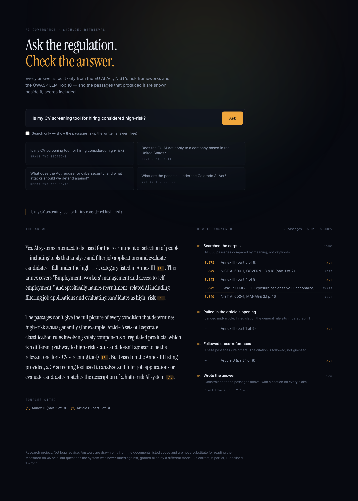
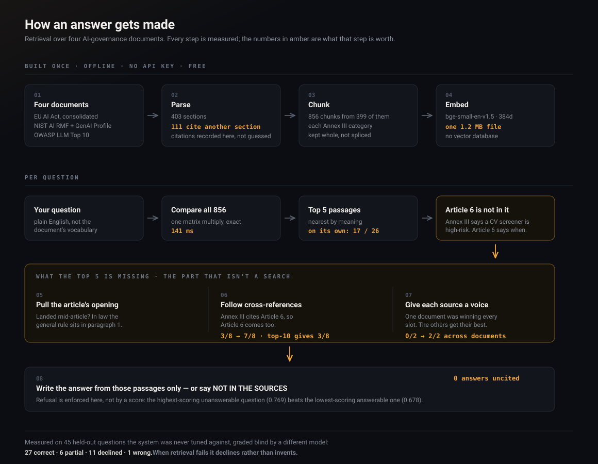
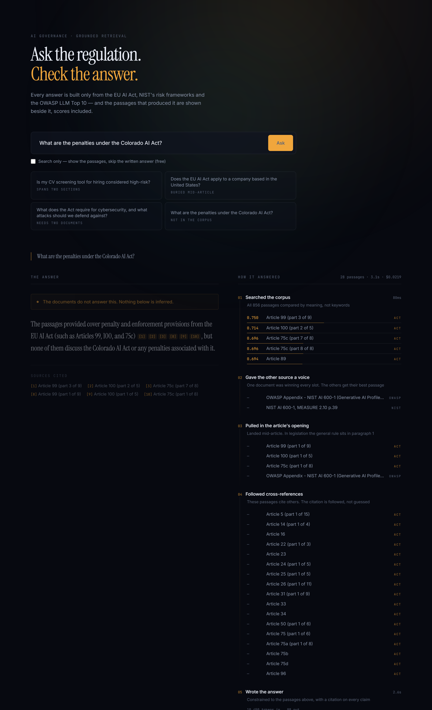

# regulatory-retrieval

Question answering across the documents that govern AI — a binding EU regulation,
two US risk frameworks, and a security standard — where every answer cites the
article, annex or page it came from, and the system declines when the documents
cannot answer.

Retrieval-augmented generation: the model answers from passages fetched out of
these four documents at query time, not from what it learned in training. Which
means the quality of the system is the quality of the retrieval, and that is the
part this repository measures.



*Every answer ships with how it was found. Here, search returned Annex III —
which says a CV screening tool is high-risk — and step 03 followed Annex III's
own citation to Article 6, which says under what conditions. Neither section
answers the question alone, and no amount of retrieving more would have found
the second one.*

## Results

Two question sets, and the evaluation is the part of this project worth
reading. Both are summarised here; every figure, every per-question grade and
the reasoning behind each one is in [FINDINGS.md](FINDINGS.md).

### Tested on questions it was never tuned against

`k`, the chunk size and both expansion steps were selected by scoring against
the 30-question tuning set, so those figures are in-sample. A second set exists
to test those choices out of sample — which is the check most RAG writeups do
not have.

45 questions, generated by a different model from 203 sections the tuning set
never touched, with answer keys derived from the source and committed before the
first run. `git log` shows the keys predate the results.

### Graded by something with no stake in the outcome

Both sets were then re-graded **blind by a separate model** — it sees the
question, the answer and the source text, never the pipeline and never whether
retrieval succeeded. Both grades are reported side by side in FINDINGS rather
than the author's alone.

### What the two sets establish

Most questions are answered correctly, and every claim in an answer carries the
article, annex or page it came from.

**Where the sources do not carry an answer, the system declines rather than
filling the gap** — and it holds on questions it has never seen. Across three
full runs, refusals and answers-without-citations do not move at all.

The set also produced two findings an in-sample check cannot: that `k` is
corpus-dependent rather than a number to inherit, and a gap in the refusal
detection that self-review had not caught, since fixed. Both are in
[FINDINGS.md](FINDINGS.md), with the numbers.

## The problem this solves

Two properties of this material break ordinary retrieval.

**The answer is often not where you look for it.** 111 of 403 sections cite
another section. Article 6 defines "high-risk" by pointing at Annex III; Annex
III's title points back at Article 6. Neither means anything alone, and a single
similarity search returns one of them.

**A retrieval system cannot tell when it does not know.** Ask for the five
nearest passages and you always get five, however far away they are. Measured
here: the highest-scoring *unanswerable* question beat the lowest-scoring
answerable one. No similarity threshold separates them.

## What it does about it

**Cross-references are recorded when the documents are parsed and followed at
query time.** Retrieving any part of Annex III pulls in Article 6 automatically,
because Annex III's own heading cites it. Deterministic, free, and incapable of
inventing a link that is not in the text. Measured: following
them more than doubles the multi-hop questions answered, while retrieving twice
as much changes nothing.

**Refusal is enforced where the answer is written**, not where passages are
found — because the measurement above shows confidence scores cannot separate
answerable from unanswerable.

**Every source group is guaranteed its best passage.** Nearest-neighbour search
returns whatever scores highest, which on a cross-document question is routinely
five passages from one document and none from the other. Reserving a slot per
source costs at most two extra passages and is query-independent.

## How it works



The same thing in text, for anyone reading this in a terminal:

```
403 sections ──chunk──> 856 passages ──embed──> 856 × 384 float32  (1.2 MB)
                                                        │
question ──embed──> 384-d vector ──── dot product ──────┘
                                          │
                                     top-k = 5
                                          │
                    ┌─────────────────────┼─────────────────────┐
              source diversity      anchor expansion     cross-references
              (best passage per     (part 1 of a         (sections the hits
               missing source)       split section)       cite, by parse-time
                                                          metadata)
                    └─────────────────────┼─────────────────────┘
                                          │
                              context, bounded at 60,000 chars
                                          │
                          one generation call, citation required
                                          │
                            cited answer  │  "NOT IN THE SOURCES"
```

**Embeddings** are `BAAI/bge-small-en-v1.5`, 384 dimensions, run locally on CPU.
The whole corpus embeds in 170s, once, for nothing.

**Search is brute force** — one matrix multiply against all 856 vectors,
unit-normalised so cosine similarity is a dot product. Exact, 141 ms at the
median, and no approximate-nearest-neighbour index to be wrong. A vector
database exists to avoid comparing against every vector; at this size that
trade is not worth making, and the index stays a file that ships with the
application.

**Chunk boundaries come from the drafter's own numbering** (`1.`, `(a)`) before
falling back to sentence ends, so provisions stay whole. Enumerated lists get one
chunk per item with no packing — Annex III's eight high-risk categories are eight
separate chunks, which is what makes "is my CV screening tool for hiring
considered high-risk"
answerable at all.

**Cross-references are extracted at parse time**, not inferred at query time.
Every chunk carries the article and annex numbers its section cites, including
chunks that never mention them — Article 6 and Annex III are different documents
and can never share a chunk, so the link survives only as metadata.

**Generation is a single call** to the answering model, with adaptive thinking,
constrained to the retrieved passages, with refusal and per-claim citation
required by the system prompt and verified afterwards in code.

## The corpus

| Source | Format | Sections |
|---|---|---|
| EU AI Act — Regulation (EU) 2024/1689, consolidated 27 July 2026 | HTML | 133 |
| NIST AI 100-1 and AI 600-1 — Risk Management Framework and Generative AI Profile | PDF | 95 |
| OWASP LLM Top 10 (2026) | Markdown | 175 |

403 sections, 815,171 characters, split into 856 chunks. The index is
**1.2 MB** — no vector database; it ships with the application.

**The Act is taken as HTML, not PDF.** EUR-Lex publishes it in 24 languages and
two formats; the HTML carries the document's own structural markup (`id="art_6"`,
`id="anx_III"`), so articles and annexes are extracted exactly rather than
inferred from layout.

**Use the consolidated text, not the 2024 original.** The Regulation was amended
by Regulation (EU) 2026/1744. Articles 4a, 60a and 75a–d exist only in the
amended version, and their presence is how `verify_sources.py` proves which text
this is. Much of the tooling in this space still answers from the superseded
version.

ISO/IEC 42001 belongs in this corpus on merit and is **not included** — it sits
behind a paywall and cannot be redistributed.

## Not legal advice

A research project. Nothing it produces is legal advice, and its answers should
not be relied on for compliance decisions.

## Run it

```bash
python -m venv .venv
```
```bash
.venv\Scripts\python.exe -m pip install -r requirements.txt
```

**The corpus and the index are committed**, so retrieval works immediately —
you do not have to rebuild anything to look around. Everything except
generating an answer is free and needs no API key.

Search, with no key and nothing to build:

```bash
.venv\Scripts\python.exe scripts\score_retrieval.py
```

Check that what is committed is what the documentation claims. These are the
point of the repository more than the pipeline is — each exits non-zero on
failure, and each exists because something it now checks was once silently
wrong:

```bash
.venv\Scripts\python.exe scripts\validate.py
```
```bash
.venv\Scripts\python.exe scripts\verify_sources.py
```
```bash
.venv\Scripts\python.exe scripts\check_chunks.py
```
```bash
.venv\Scripts\python.exe scripts\verify_index.py
```
```bash
.venv\Scripts\python.exe scripts\verify_embeddings.py
```
```bash
.venv\Scripts\python.exe scripts\test_scoring.py
```
```bash
.venv\Scripts\python.exe scripts\check_docs.py
```

To rebuild the corpus from the published sources instead — about three minutes,
mostly embedding on CPU. It is deterministic: `chunks.json` and `index.npz`
come back byte-identical.

```bash
.venv\Scripts\python.exe scripts\fetch.py
```
```bash
.venv\Scripts\python.exe scripts\parse_act.py
```
```bash
.venv\Scripts\python.exe scripts\parse_nist.py
```
```bash
.venv\Scripts\python.exe scripts\parse_owasp.py
```
```bash
.venv\Scripts\python.exe scripts\build_corpus.py
```
```bash
.venv\Scripts\python.exe scripts\chunk.py
```
```bash
.venv\Scripts\python.exe scripts\embed.py
```

Ask a question (needs a key in `api-key.txt`, which is gitignored):

```bash
.venv\Scripts\python.exe scripts\answer.py "Is my CV screening tool for hiring considered high-risk?"
```

Score retrieval, compare every retrieval strategy, run the full evaluation:

```bash
.venv\Scripts\python.exe scripts\compare_arms.py
```
```bash
.venv\Scripts\python.exe scripts\run_full_eval.py
```
```bash
.venv\Scripts\python.exe scripts\metrics.py
```

The held-out set and the blind grader — the checks that stop this being tuned
on its own test set. `run_holdout.py` is free without `--generate`:

```bash
.venv\Scripts\python.exe scripts\run_holdout.py
```
```bash
.venv\Scripts\python.exe scripts\grade_blind.py holdout
```

Sweeps, if you want to re-argue a decision rather than take it on trust. Both
restore the shipped artefacts afterwards:

```bash
.venv\Scripts\python.exe scripts\sweep_chunking.py
```
```bash
.venv\Scripts\python.exe scripts\run_variance.py
```

### The interface

FastAPI over the same retrieval engine the evaluation scores, and a Next.js
front end that shows the trace beside every answer:

```bash
.venv\Scripts\python.exe -m uvicorn api.server:app --reload --port 8000
```
```bash
npm install --prefix ui
```
```bash
npm run dev --prefix ui
```

`/?q=your+question` asks on load, and asking rewrites the address bar — so an
answer, with the passages and scores that produced it, is a link you can send
someone. Both images in this README were produced from such a URL rather than by
driving the page by hand.



*The behaviour worth showing is the one where it stops. Asked about the Colorado
AI Act — deliberately not in the corpus — it declines, then names what it
actually retrieved (Articles 99, 100 and 75c) and states that none of them
mention Colorado. It refuses without pretending the shelf was empty.*

## Verification

Every stage has a script that re-checks it. All exit non-zero on failure, so any
of them can gate a build.

| Script | Checks |
|---|---|
| `verify_upstream.py` | The committed bytes still match what the publishers serve |
| `verify_sources.py` | Integrity (sha256) and identity (is this the document it claims to be) |
| `validate.py` | Parsing coverage, article numbering, cross-reference integrity |
| `check_chunks.py` | Chunk boundary quality — where cuts landed, what they broke |
| `verify_index.py` | 15 checks: alignment, vector sanity, self-retrieval |
| `verify_embeddings.py` | The embedding step does what the code says it does |
| `validate_questions.py` | Every answer key names a section that exists |
| `test_scoring.py` | The graders agree with 18 hand-computed verdicts |
| `check_docs.py` | Every figure in this file matches the pipeline |

## Everything else in `scripts/`

| Script | Does |
|---|---|
| `fetch.py` | Downloads the four sources. Already committed, so this is only needed to re-fetch |
| `parse_act.py` `parse_nist.py` `parse_owasp.py` | One parser per format. The two NIST documents needed **different** rules — forcing one across both is what produced an 80,000-character "section" |
| `build_corpus.py` | Merges the three into `corpus.json` |
| `chunk.py` | 403 sections → 856 passages |
| `embed.py` | Builds `index.npz`. Local, CPU, no key |
| `retrieval.py` | **The retrieval engine.** Search, source diversity, anchor expansion, cross-reference following. `answer.py` and the evaluation both call this, so they cannot drift apart |
| `answer.py` | Retrieval plus one generation call, with the trace |
| `score_retrieval.py` | Scores retrieval alone against the question set. No model, no cost |
| `compare_arms.py` | Scores each retrieval step separately, so a change can be measured before it is adopted |
| `run_full_eval.py` | All 30 questions end to end. The only script here that spends money |
| `metrics.py` | Reads the saved run and reports it. Regenerating this is free |
| `report_scores.py` | Per-question scorecard for a retrieval-only run |
| `review_answers.py` | Prints each answer beside its citations, for the hand grading in `data/eval/correctness.json` |

## Limits

**One question the system cannot retrieve.** "Can an ordinary person complain
about an AI system?" never reaches Article 85, *"Right to lodge a complaint with
a market surveillance authority"*. Asked in the statute's own words it returns at
rank 1. The question and the text share no vocabulary, and this is not a cutoff
problem — **Article 85 does not appear in the top 50 of 856 passages.** Rewriting
the question into the register of the source before searching would address it;
that is not built.

**Retrieval is stronger in sample than out of it.** The held-out set surfaces
the exact section less often than the tuning set does; the figures are in
[FINDINGS.md](FINDINGS.md). What it establishes is what happens across that
gap: where retrieval falls short, the system declines rather than filling it.

**Sample size.** 75 questions across the two sets. Read every figure as a
fraction, not a percentage.

**Answer quality beyond citation grounding is unassessed** — whether an answer is
a *good* summary, not merely a supported one. Per-answer reasoning for every
graded question is in `data/eval/` so any judgement here can be disputed rather
than taken on trust.

Engineering notes, including what was measured and rejected, are in
[FINDINGS.md](FINDINGS.md).
